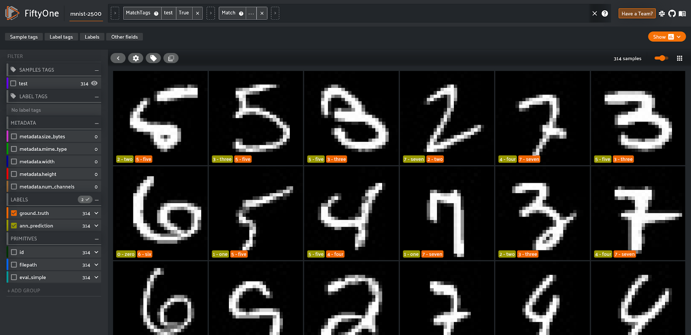

# demo-qdrant-fiftyone

[FiftyOne](https://voxel51.com/docs/fiftyone/) is a tool designed to support 
creating high-quality visual datasets. It allows inspecting the data points and 
monitoring the performance of your models to allow reacting much faster if you 
spot a degraded quality of the predictions.



[Qdrant](https://qdrant.tech) is a vector database designed to perform an approximate 
nearest neighbour search (ANN) on dense neural embeddings. Those embeddings have 
some interesting capabilities, as they are able to capture the semantics of the 
data points. This is especially useful for unstructured data like images and videos, 
so you can encode not only pixel similarities but also some more complex relationships.

The neural search might be a great strategy for performing a classification, based on 
the similarity to the examples from the training set, in a way similar to k-NN,
but with much better performance.

This repository contains a working example of integrating [Qdrant](https://qdrant.tech) 
with [FiftyOne](https://voxel51.com/docs/fiftyone/). The example uses the MNIST dataset 
and performs a classification of the test samples using Approximate Neural Neighbours 
in the embedding space, using cosine distance.

## Running the example

The example requires some dependencies to be installed:

```shell
pip install -r requirements.txt
```

Qdrant has to be launched using Docker:

```shell
bash run_qdrant.sh
```

Finally, the script performing the classification and running FiftyOne in web
browser can be launched via:

```shell
python main.py
```

As a result, the script should open the default web browser with the 
[FiftyOne](https://voxel51.com/docs/fiftyone/) UI showing the misclassified 
examples.
